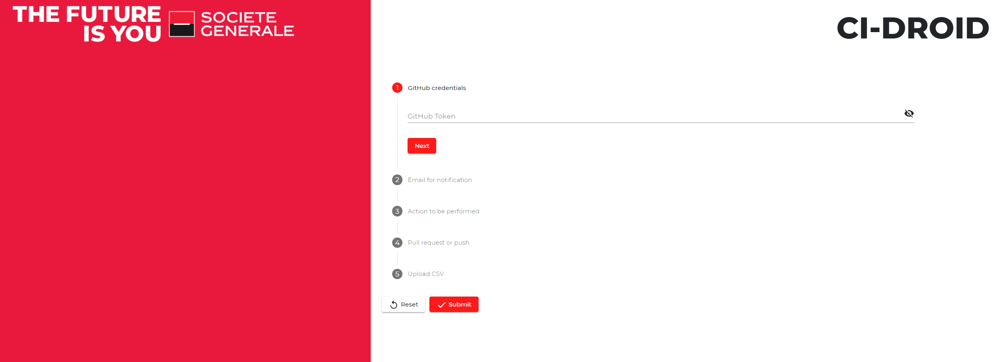

# CI-Droid

[](https://travis-ci.org/societe-generale/ci-droid) [](https://coveralls.io/github/societe-generale/ci-droid?branch=master)

The dev team best buddy, taking care of all the housekeeping for your repositories and giving tips to developers !

### Overall architecture


A webhook is declared at GitHub organization level - all "push" events for all the repositories are sent to that webhook.
CI-droid webhook is receiving these events, provided you've configured the webhook to receive the proper event types :


If it is configured to process the events (there are some filters), it then forwards them to either 1 of 2 channels depending on where the push happened:

- on the default branch
- on another branch than the default branch - typically for a PR

Several instances of [CI-droid tasks-consumer](https://github.com/societe-generale/ci-droid-tasks-consumer) service are listening and processing the events on the other side of the channels.

#### push on default branch

The main actions that we can take care when there's a push on default branch deal with the impacts on the open pull requests for the repository :

- notify developer if his/her PR is not mergeable anymore, following the push in default branch
- if the PR is still mergeable, rebase the branch with latest commits from master : the goal is to keep the PR up-to-date with default branch and avoid the case in which a green PR with a couple of commits from master are missing gets merged and breaks the build in default branch
- if some of the open pull requests are older than a defined limit (6 months by default), they will be closed

#### pull request events

When a pull request event happens (either creating or updating a pull request), CI-droid can then assist the dev team by providing comments in the PR.
We configure a map associating a file pattern to a small best practice document (ideally, the URL of a .md file), and if any of the file in the PR matches the pattern, the content of the best practice document will be "pasted" in the PR as a comment by CI-droid.

This feature makes the best practices more "alive", compared to a static document written once, refered initialy, but then rarely updated/remembered : it's very easy to add new pattern / best practice documents mapping, and to update them.
It also enables team to save time, as the review comment is immediate and the developer can take actions before the reviewer starts reviewing.

#### ad-hoc "bulk" actions

Especially for teams that have adopted micro-services architecture, it's not rare to have several dozens of repositories.
They usually follow some convention(s), but when there are changes to perform across all repositories (because we upgrade to new Docker version, or we want to upgrade the version of a plugin), making the update consistently across the organization can be a daunting task, spanning over weeks.

CI-droid has a specific endpoint that enables the user to request a bulk update. Wherever you have deployed CI-Droid, you can hit the Swagger endpoint to get the API description.
For example, if deployed on your machine, you can open http://localhost:8080/swagger-ui.html# in your browser

Below is a typical message you could POST on /cidroid-actions/bulkUpdates :

```json

{
  "gitLogin": "vincent-fuchs",
  "gitHubOauthToken": "abcdef1234569687kugfwkugfewha",
  "email": "vincent.fuchs@gmail.com",

  "commitMessage": "updating Jenkinsfile with latest java image for build",

 "updateAction": {
    "@class": "com.societegenerale.cidroid.extensions.actionToReplicate.SimpleReplaceAction",
    "initialValue": "JDK1.8-20170718-121455-e2e6123",
    "newValue": "JDK1.8-20180917-093720-5fdabcb014"
  },

  "gitHubInteractionType": {
    "@c": ".PullRequestGitHubInteraction",
    "branchNameToCreate": "newJavaImageForJenkinsBuild",
    "pullRequestTitle": "Using new image for Jenkins build"
  },

  "resourcesToUpdate": [

	{"repoFullName": "myOrga/project_A","filePathOnRepo": "Jenkinsfile","branchName": "master"},
	{"repoFullName": "myOrga/project_B","filePathOnRepo": "Jenkinsfile","branchName": "master"},
	{"repoFullName": "myOrga/project_C","filePathOnRepo": "Jenkinsfile","branchName": "master"},
	{"repoFullName": "myOrga/project_D","filePathOnRepo": "Jenkinsfile","branchName": "master"}

    ...some other resources if required

  ]
}
```

Explanations :

- the first 4 fields are self explanatory : credentials + the commit message to use.
- updateAction is one of the classes available implementing [ActionToReplicate](https://github.com/societe-generale/ci-droid-internal-api/blob/73acab2178c81803f17a542cf98b60aa3397547a/src/main/java/com/societegenerale/cidroid/api/actionToReplicate/ActionToReplicate.java) . The list of available actions is available on GET /cidroid-actions/availableActions (see swagger doc).
  It represents the action that will be performed on the resources we mention after. It will basically download the file, modify it according to the ActionToReplicate logic, and commit it if it has been modified.
- gitHubInteractionType represents either a direct push (.DirectPushGitHubInteraction), or a pullRequest (.PullRequestGitHubInteraction). In case of pull request, branchNameToCreate and pullRequestTitle need to be provided.
- resourcesToUpdate is the list of resources that CI-droid will try to modify : they can be on different repositories / branches

When posted on the bulkUpdate endpoint, above payload will be duplicated into 4 messages, with one resource each, and passed to ci-droid-tasks-consumers.

The consumers will then try to modify each resources on behalf of the user. In above case, it will :

- create a branch from master named newJavaImageForJenkinsBuild
- download Jenkinsfile at the root of each mentioned repository (myOrga/project_A, myOrga/project_B, etc)\
- if the file contains the string _JDK1.8-20170718-121455-e2e6123_, we replace the new value _JDK1.8-20180917-093720-5fdabcb014_ , and commit in the branch with the provided credentials and message
- if a change was done, a PR with title _"Using new image for Jenkins build"_ gets created
- for each resource, user will receive a status email, either KO or OK, with a link to the change.

Performing bulk actions with CI-droid can literally save hours and hours of boring work by the dev team !

#### performing bulk actions through the GUI

starting with version 1.1.1, CI-droid comes with a GUI ! just hit http://localhost:8080/ and you should get access to it :



## Extending CI-droid

Both CI-droid and CI-droid-tasks-consumer are packaged the same way. For both, we build :

- a "fat jar", that you can run "as is" from command line, providing your own config file on the side
- a starter, that you can use as a dependency in your custom project.

For instance, to create your own CI-droid-tasks-consumer, leveraging on the starter, you can start with this config :

```xml
    <properties>
        <project.build.sourceEncoding>UTF-8</project.build.sourceEncoding>
        <project.reporting.outputEncoding>UTF-8</project.reporting.outputEncoding>
        <java.version>1.8</java.version>
        <ci-droid-tasks-consumer.version>1.1.1</ci-droid-tasks-consumer.version>
    </properties>

    <dependencyManagement>
        <dependencies>
        <dependency>
            <groupId>com.societegenerale.ci-droid.tasks-consumer</groupId>
            <artifactId>ci-droid-tasks-consumer-parent</artifactId>
            <type>pom</type>
            <scope>import</scope>
            <version>${ci-droid-tasks-consumer.version}</version>
        </dependency>
        </dependencies>
    </dependencyManagement>

    <dependencies>

        <dependency>
            <groupId>com.societegenerale.ci-droid.tasks-consumer</groupId>
            <artifactId>ci-droid-tasks-consumer-starter</artifactId>
            <version>${ci-droid-tasks-consumer.version}</version>
        </dependency>

    </dependencies>
```

If you add your own Spring components and load them the right way, they will be taken into account and integrated with the existing CI-droid core.
